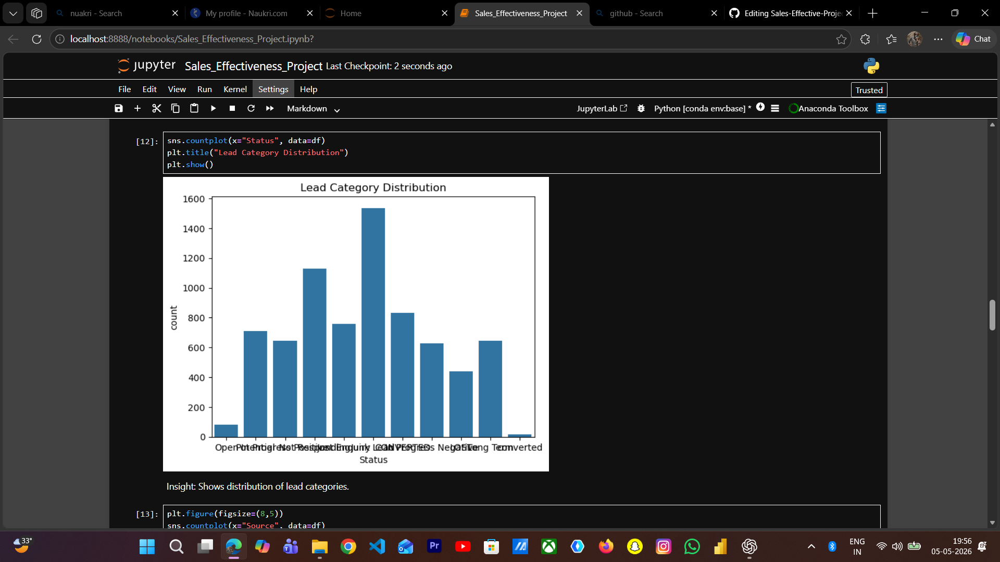
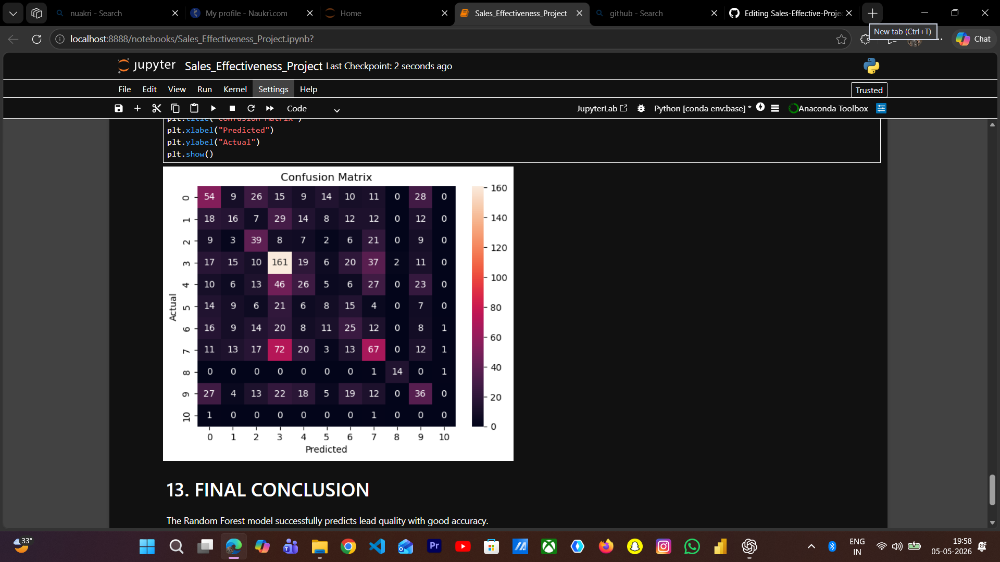

# 📊 Sales Effectiveness Analysis

## 📌 Project Overview
This project focuses on analyzing sales data to evaluate business performance and identify key factors influencing sales effectiveness. The goal is to derive meaningful insights that can support better decision-making and improve overall sales strategies.

---

## 🎯 Objectives
- Analyze sales trends and performance  
- Identify key factors affecting sales  
- Perform data cleaning and preprocessing  
- Generate actionable business insights  

---

## 🛠️ Tech Stack
- Python  
- Pandas  
- NumPy  
- Matplotlib  
- Seaborn  

---

## 🔍 Workflow
1. Data Cleaning & Preprocessing  
2. Exploratory Data Analysis (EDA)  
3. Data Visualization  
4. Insight Generation  

---

## 📈 Key Insights
- Identified patterns in sales performance  
- Highlighted important factors influencing revenue  
- Observed trends that can improve business strategies  

---

## 💡 Business Impact
- Helps in understanding customer behavior  
- Supports data-driven decision-making  
- Improves sales planning and strategy  

---

## 📊 Sample Outputs

---

## 📁 Project Structure
- `Sales_Effectiveness_Project.ipynb` → Main analysis notebook  

---

## 🚀 Future Improvements
- Build predictive model for sales forecasting  
- Create interactive dashboard using Power BI  

---

## 👨‍💻 Author
**Tharun Chavali**  
- Aspiring Data Analyst  
- Skilled in Python, SQL, and Data Analysis
